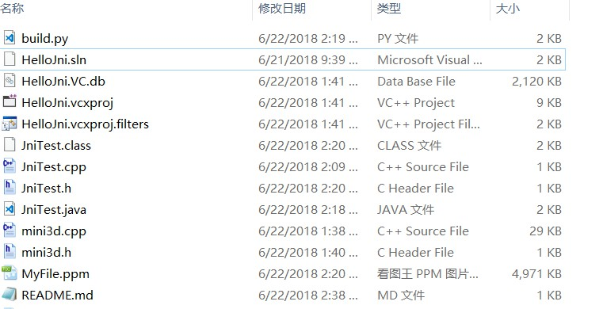

# 超~~~~~简单JNI调用

## 目的
熟悉一下java的写法
## 功能
java调用c++写的一个软件渲染器渲染图像，并将渲染好的图像保存下来

## 所有文件

## 流程
1. JniTest.java > JniTest.h
2. 实现JniTest.h中函数的功能 >JniTest.cpp
3. MSBuild编译JniTest.cpp > HelloJni.dll
4. 运行JniTest.java > 输出图像文件

## 前提
windows平台，linux换一下g++应该就行
## 准备
1. vs2015(需要使用msbuild)
>当然你也可以使用vs2013，不过要修改sln和vcxproj文件

2. jdk-10.0.1
>我想用var关键字，所以卸了jdk8装了jdk10

3. Python
>用来制作自动化脚本

## 运行 
```
python build.py JinTest.java
```
## 结果
输出MyFile.ppm文件，请用专用的图片查看软件(如看图王来打开，类似如下结果)

